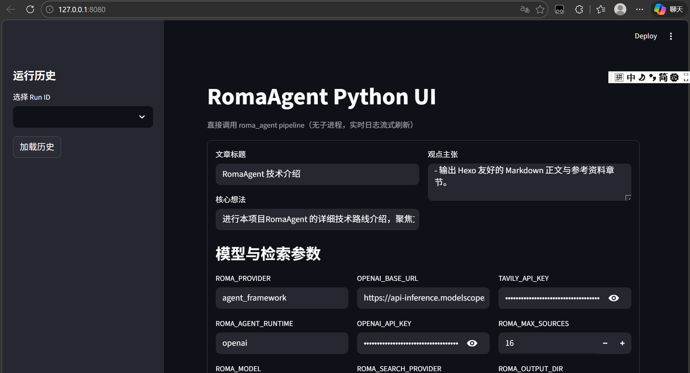
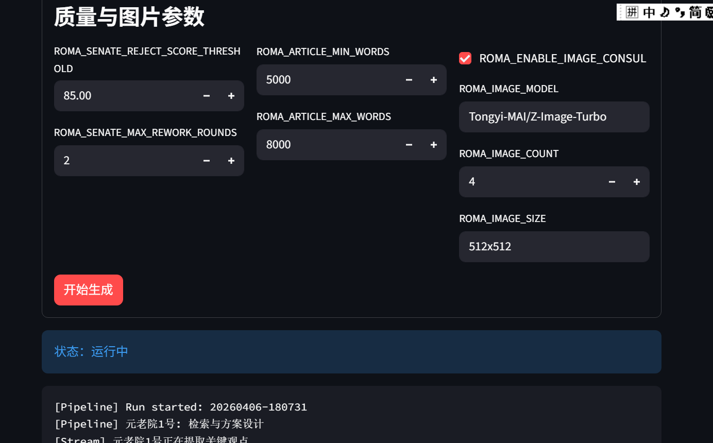
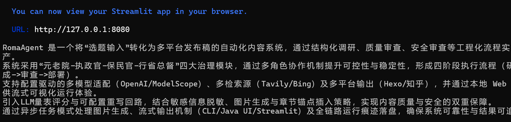

# RomaAgent

RomaAgent 是一个“输入一个想法，自动产出多平台技术文章”的内容工程化系统。

核心目标：
- 让写作流程可编排、可审查、可追溯。
- 在生成质量、事实依据、安全合规与发布形态之间取得平衡。
- 用配置驱动适配不同模型网关（OpenAI 兼容、ModelScope 等）与不同发布渠道。
## 先是碎碎念（整个项⽬唯⼀⼈⼿写的）
灵感来⾃于⼀个之前很⽕的openclaw agent——三省六部，但我只是做博客agent也⽤不了
那么多agent，再加上发电，就做了⼀个罗⻢agent（万物皆可罗⻢）。

api来⾃于魔搭（每天1000次Inference额度穷⼈吹爆），⽂本⽣成模型Qwen3-32B，图⽚⽣
成模型Z-Image-Turbo。

整个项⽬全部vibe coding，啊不，AI coding，使⽤之前学⽣认证的Copilot Pro(Claude code烧token有点贵，codex感觉Copilot Pro也能⽤GPT-5.3 codex所以也没什么必要再买)，从⼋点开始写,写了半天⼀个⽉的token量就烧了快30%，⼈脑vibe coding不⽤token.jpg。
## 核心特性

- 罗马治理架构多角色协作（元老院/执政官/保民官/总督）。
- 联网检索（Tavily / Bing）与结构化资料包。
- LLM 量表评分 + 可配置重写回路。
- 保民官隐私脱敏审查。
- 图片执政官自动生成“架构解释型”配图。
- 配图按章节锚点插入（不是堆在文首）。
- CLI 与 Java UI 均支持流式输出。
- 完整运行工件落盘（JSON、草稿、部署稿、图片元数据）。

## 角色与流程

角色：
- Consul（执政官）：撰写正文。
- Senate Agent 1（元老院1号）：检索、提炼数据、给出大纲与配图位置建议。
- Senate Agent 2（元老院2号）：量表评分与重写建议。
- Tribune（保民官）：安全审查与脱敏。
- Image Consul（图片执政官）：生成章节配图。
- Governor（行省总督）：输出 Hexo / Zhihu 发布稿。

执行顺序：
1. 元老院1号（检索 + 资料包）
2. 执政官（初稿）
3. 元老院2号（评审，必要时重写）
4. 保民官（安全审查）
5. 图片执政官（配图）
6. 行省总督（平台部署）

## 快速开始

1. 安装依赖

```bash
pip install -e .
```

2. 配置环境

```bash
copy .env.example .env
```

3. 运行一次

```bash
roma-agent --idea "请写一篇关于 AI 时代 CPU 路线分化的技术文章"
```

大文本输入（例如整份 README / 技术文档）建议使用文件参数：

```bash
roma-agent --idea-file .\\README.md
```

4. 查看产物目录 `output/<run_id>/`

- `pipeline_result.json`
- `senate_brief.md`
- `consul_draft.md`
- `draft.md`
- `tribune_report.md`
- `images.json`
- `images/`
- `deployments/hexo.md`
- `deployments/zhihu.md`

## 关键配置

### 模型与运行时

- `ROMA_PROVIDER`：`mock` / `agent_framework`
- `ROMA_AGENT_RUNTIME`：`foundry` / `openai` / `auto`
- `ROMA_MODEL`：文本模型名
- `OPENAI_BASE_URL`：OpenAI 兼容网关地址
- `OPENAI_API_KEY`：访问密钥

### 检索

- `ROMA_SEARCH_PROVIDER`：`tavily` / `bing`
- `ROMA_MAX_SOURCES`：检索来源上限
- `TAVILY_API_KEY` / `BING_SEARCH_V7_*`

### 质量控制

- `ROMA_SENATE_REJECT_SCORE_THRESHOLD`
- `ROMA_SENATE_MAX_REWORK_ROUNDS`

### 图片执政官

- `ROMA_ENABLE_IMAGE_CONSUL=true|false`
- `ROMA_IMAGE_MODEL`
- `ROMA_IMAGE_COUNT`
- `ROMA_IMAGE_SIZE`
- `ROMA_IMAGE_POLL_INTERVAL_SECONDS`
- `ROMA_IMAGE_POLL_TIMEOUT_SECONDS`

说明：ModelScope 图片接口走异步任务模式（提交任务 + 轮询），并已在 provider 中兼容。

### 字数设置（已支持 .env 配置）

- `ROMA_ARTICLE_MIN_WORDS`
- `ROMA_ARTICLE_MAX_WORDS`

## 流式输出说明

- CLI：阶段日志 + 模型 chunk 实时输出。
- Java UI：SSE 实时推送，浏览器终端输出区逐字滚动。
- 编码兼容：针对 UTF-8/网关字符集差异做了解码兜底，降低乱码概率。

## 已处理的常见问题

- Windows 非 ASCII 路径下 `spring-boot:run` 启动异常：改为 `java -jar` 方式。
- Java UI 根目录定位失败：改为向上搜索 `pyproject.toml`。
- 评分返回 `score` 为对象导致崩溃：已兼容分项字典求和。
- 图片接口 400：已适配 ModelScope 异步任务协议。
- Hexo 整文被包进代码块：发布前剥离外层 fenced code block。

## Java UI

Java UI 详细说明见 [java-ui/README.md](java-ui/README.md)。

## Python UI

Python UI 详细说明见 [python-ui/README.md](python-ui/README.md)。

## Python UI EXE 使用与打包说明

### 运行 EXE

- 产物路径：`dist/RomaAgentPythonUI.exe`
- 支持端口参数：`-p` / `--port`

示例：

```bash
dist\RomaAgentPythonUI.exe -p 3000
```

成功启动后可访问：

```text
http://127.0.0.1:3000
```

### 打包命令（Windows）

```bash
powershell -ExecutionPolicy Bypass -File python-ui/build_exe.ps1
```

说明：

- 打包脚本使用 `cmd + conda activate roma-agent` 固定构建环境，避免多 Python 环境漂移。
- EXE 运行时不要求用户激活 conda；但打包阶段必须使用正确环境，才能冻结正确依赖版本。

### 常见问题与处理

- `agent-framework is not installed`：已在打包链路中修复（安装项目依赖 + 显式收集 `agent_framework` 动态导入模块）。
- `server.port does not work when global.developmentMode is true`：已在 `launcher.py` 关闭 development mode，并允许 `-p` 覆盖端口。
- 双击无反应难排查：当前 EXE 已开启控制台输出（debug 友好），可直接看到 traceback。

## 项目结构

```text
src/roma_agent/
  cli.py
  config.py
  models.py
  pipeline.py
  providers.py
  research.py
  writer.py
  roman_roles.py
  publisher.py
java-ui/
prompts/
examples/
AGENT.md
```
## UI



下面是该项目生成的博客demo
---
title: "《RomaAgent技术解析：多Agent驱动的自动化内容工程系统》"
date: 2026-04-06 18:15:01
tags:
  - AI
  - Agent
  - Automation
categories:
  - Engineering

---

# RomaAgent 技术解析：多Agent驱动的自动化内容工程系统

## 1. 项目定位与核心价值

RomaAgent 是一个面向"单点想法到多平台发布稿"的自动化内容工程系统，其核心价值体现在四大创新维度：

1. **工程化流程重构**：将传统内容生产流程转化为可配置、可追踪的流水线作业，通过结构化调研、质量审查、安全审查等环节实现内容生产的标准化
2. **多角色治理机制**：采用"元老院-执政官-保民官-行省总督"的罗马治理模型，通过模块化分工提升系统的可控性、可解释性和稳定性
3. **配置驱动架构**：支持OpenAI/ModelScope等多模型适配、Tavily/Bing等多检索源接入，以及Hexo/知乎等多平台输出的灵活配置
4. **可视化交互体验**：通过本地Web控制台提供实时流式输出，结合CLI和Java UI实现多终端协同操作

] 

## 2. 罗马治理模型解析

系统采用"四大治理块+块内细分单元"的编排模式，形成四阶段执行流程：

### 2.1 元老院（Senate）

- **研究单元**：负责构建检索查询词、提炼核心数据、生成写作大纲和配图建议
- **质控单元**：执行LLM量表评分（结构/事实依据/清晰度/实用价值/风格一致性），触发重写回路

### 2.2 执政官（Consul）

- **正文生成单元**：基于元老院资料包生成标题与正文内容
- **配图生成单元**：采用"规划->细化->生成"链路，按章节语义生成架构解释型图片

### 2.3 保民官（Tribune）

- 执行敏感信息脱敏（API Key/邮箱/手机号识别），输出结构化审查报告

### 2.4 行省总督（Governor）

- 负责平台封装与部署落盘，输出Hexo/知乎格式的可发布稿件

] 

## 3. 端到端生成流程

系统从单条idea文本出发，经过七步完成内容生产：

1. **元老院研究单元**构建检索查询词并抓取资料
2. 生成结构化"元老院资料包"（包含核心数据、写作大纲、配图建议）
3. **执政官正文生成单元**产出标题与正文内容
4. **元老院质控单元**执行评分并按规则决定是否重写（最大轮次可配置）
5. **执政官配图生成单元**执行图片生成并绑定章节目标
6. **保民官**执行安全审查并输出审查意见
7. **行省总督**输出平台稿件并写入运行目录

每次运行生成独立run_id目录，包含：

- pipeline_result.json
- senate_brief.md
- consul_draft.md
- draft.md
- tribune_report.md
- images.json
- images/
- deployments/hexo.md
- deployments/zhihu.md

## 4. 核心技术实现

### 4.1 模型与Provider设计

- **文本生成**：支持mock provider、agent_framework provider（foundry/openai/auto）和OpenAI兼容REST兜底
- **图片生成**：ImageProvider抽象接口，支持OpenAI兼容接口和ModelScope异步任务模式（提交->轮询->下载）

# Provider接口统一设计

def generate(system_prompt, user_prompt, on_chunk):
    # 支持流式chunk回调
    pass

### 4.2 检索与知识整编

- **双适配检索层**：Tavily/Bing双引擎支持，URL去重，最大来源数量可配
- **整编层**：关键观点抽取、核心数据句段提取、写作大纲生成、图片规划

### 4.3 流式输出机制

- **CLI**：Pipeline阶段日志实时输出，LLM chunk流式输出，强制UTF-8编码
- **Java UI**：SSE双阶段接口（/run/prepare + /run/stream），前端EventSource实时追加输出
- **Python UI**：Streamlit直接调用RomaPipeline，支持线程+队列实时日志刷新

] 

## 5. 质量与安全双审查体系

### 5.1 质量审查机制

- **评分量表**：五维评分（结构/事实依据/清晰度/实用价值/风格一致性）
- **兼容性增强**：支持单值数字评分、分项字典自动求和、JSON解析失败回退启发式评分
- **重写触发**：低于阈值或问题数量达阈值触发，最大重写轮次可配置

### 5.2 安全审查机制

- **脱敏规则**：
   - API Key识别（正则匹配常见格式）
   - 邮箱识别（@符号前后字符匹配）
   - 手机号识别（国际区号+数字组合）
- **输出产物**：审查后草稿、结构化issue列表、tribune_report.md

## 6. 可视化交互设计

### 6.1 CLI交互

- 实时输出Pipeline阶段日志
- LLM chunk流式显示（每100ms刷新一次）
- UTF-8强制编码避免乱码

### 6.2 Web UI交互

- **Java UI**：SSE双阶段接口实现实时日志追踪
- **Streamlit UI**：支持历史运行目录回放，EXE入口支持-p参数指定端口
- **交互增强**：运行结束后自动回填结果面板（状态、run_id、草稿、报告）

] 

## 7. 配置驱动与扩展性

### 7.1 关键配置项

- **基础配置**：ROMA_PROVIDER/ROMA_MODEL/OPENAI_API_KEY等
- **检索配置**：ROMA_SEARCH_PROVIDER/ROMA_MAX_SOURCES等
- **质控配置**：ROMA_SENATE_REJECT_SCORE_THRESHOLD等
- **图片配置**：ROMA_IMAGE_MODEL/ROMA_IMAGE_COUNT等
- **稳定性配置**：OPENAI_TIMEOUT_SECONDS等

### 7.2 扩展性设计

- **异步任务模式**：ModelScope图片生成采用提交->轮询->下载的异步处理
- **多级容错**：保留接口探测与格式容错，兼容不同网关响应格式漂移
- **平台适配器**：预留公众号/掘金/CSDN等平台扩展接口

## 8. 工程化可靠性设计

### 8.1 编码稳定性措施

- Python子进程设置PYTHONUNBUFFERED
- 强制PYTHONIOENCODING=UTF-8
- 流式解析按字节读取并显式UTF-8解码

### 8.2 运行可靠性保障

- 429限流缓解策略：降低sources/image_count、增大重试退避、错峰请求
- 事实幻觉风险控制：强化"来源-结论"绑定和后验核查
- 体积控制：忽略build/dist目录，使用对象存储发布二进制

## 参考资料

1. [Microsoft Agent Framework Overview](https://learn.microsoft.com/en-us/agent-framework/overview/) | 可信度：0.90
2. [Agent Framework Python Samples](https://github.com/microsoft/agent-framework/tree/main/python/samples) | 可信度：0.88
3. [Content Workflow Design](https://example.com/content-workflow-design) | 可信度：0.55
4. [Problem framing for RomaAgent](https://example.com/idea-specific-notes) | 可信度：0.50

> 注：可信度低于0.7的参考资料建议结合其他来源交叉验证，避免过度依赖单一低可信度数据。